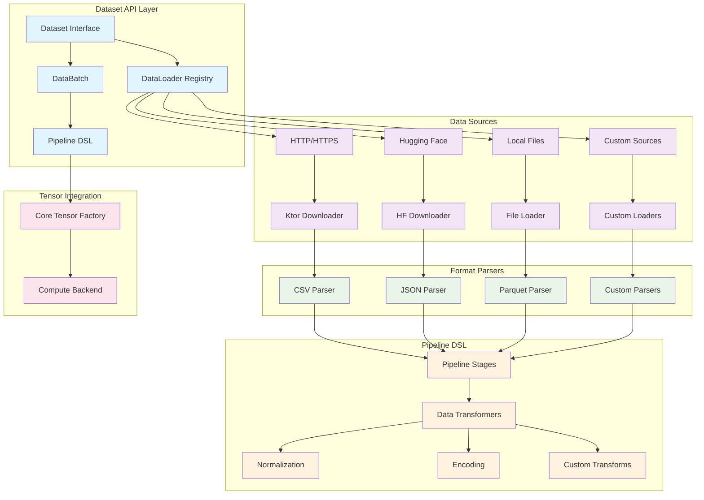
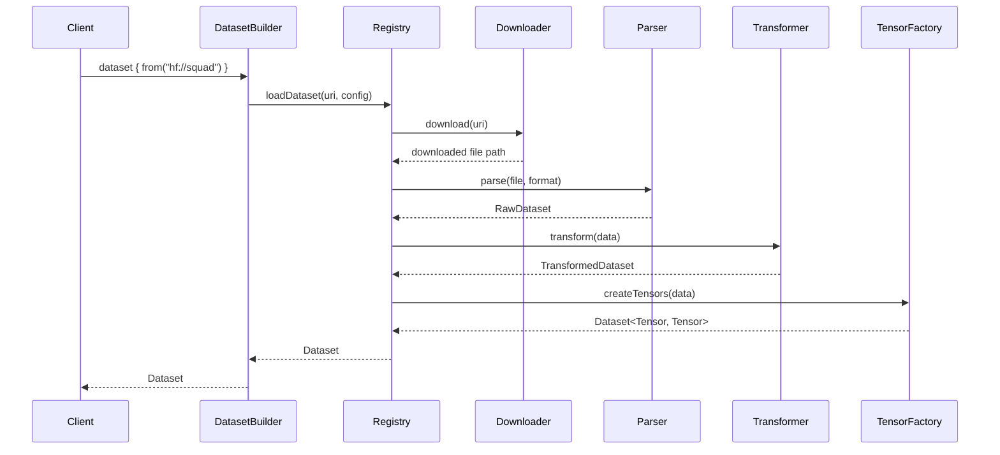
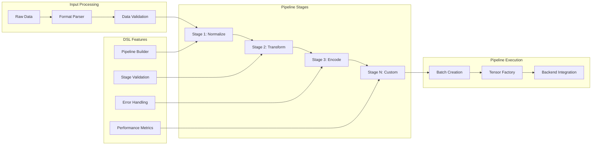

# SKAINet Dataset API Architecture

## Overview

This document outlines the improved architecture for the SKAINet dataset API, focusing on ML training/evaluation operations, pluggable data loaders, pipeline DSL support, and a Kotlinish API design.

## Current State Analysis

The existing dataset API provides basic functionality:
- Generic `Dataset<T, Y>` abstract class
- Basic operations: split, shuffle, batch iteration
- Simple `DataBatch<T, V>` for batched data
- Integration with tensor system via `DType` and `Shape`

## Proposed Architecture

### 1. Core Dataset API Improvements

#### Enhanced Dataset Interface

```kotlin
interface Dataset<X, Y> {
    // Basic properties
    val size: Int
    val inputShape: Shape
    val outputShape: Shape?
    
    // Data access
    suspend fun getX(index: Int): X
    suspend fun getY(index: Int): Y
    suspend fun getBatch(indices: IntRange): DataBatch<X, Y>
    
    // ML operations
    fun split(ratio: Double, stratified: Boolean = false): Pair<Dataset<X, Y>, Dataset<X, Y>>
    fun shuffle(seed: Long? = null): Dataset<X, Y>
    fun filter(predicate: (X, Y) -> Boolean): Dataset<X, Y>
    fun transform(transformer: DataTransformer<X, Y>): Dataset<X, Y>
    
    // Iteration
    fun batches(batchSize: Int, shuffle: Boolean = true): Flow<DataBatch<X, Y>>
    fun epochs(epochCount: Int, batchSize: Int): Flow<DataBatch<X, Y>>
}
```

#### Enhanced DataBatch

```kotlin
data class DataBatch<X, Y>(
    val inputs: Array<X>,
    val targets: Array<Y>?,
    val indices: IntArray,
    val metadata: Map<String, Any> = emptyMap()
) {
    val batchSize: Int get() = indices.size
    
    // Tensor creation delegated to core tensor factory
    fun <D: DType, V> toTensors(backend: ComputeBackend<D, V>): Pair<Tensor<D, V>, Tensor<D, V>?> {
        val inputTensor = backend.createTensor(inputs, Shape(batchSize, *inputShape.dimensions))
        val targetTensor = targets?.let { backend.createTensor(it, Shape(batchSize, *outputShape.dimensions)) }
        return inputTensor to targetTensor
    }
    
    // Batch operations
    fun slice(range: IntRange): DataBatch<X, Y>
    fun shuffle(): DataBatch<X, Y>
}
```

### 2. Pipeline DSL Support

#### Pipeline Builder

```kotlin
interface PipelineStage<In, Out> {
    val name: String
    suspend fun process(input: In): Out
    fun validate(input: In): Boolean = true
}

class DataPipeline<T> {
    private val stages = mutableListOf<PipelineStage<*, *>>()
    
    fun <U> stage(stage: PipelineStage<T, U>): DataPipeline<U> = apply {
        stages.add(stage)
    } as DataPipeline<U>
    
    suspend fun execute(input: T): Any {
        return stages.fold(input as Any) { data, stage ->
            (stage as PipelineStage<Any, Any>).process(data)
        }
    }
    
    fun describe(): String = stages.joinToString(" -> ") { it.name }
}

// DSL Functions
fun <T> pipeline(block: DataPipeline<T>.() -> Unit): DataPipeline<T> {
    return DataPipeline<T>().apply(block)
}

inline fun <reified T, reified U> stage(
    name: String,
    crossinline transform: suspend (T) -> U
): PipelineStage<T, U> = object : PipelineStage<T, U> {
    override val name = name
    override suspend fun process(input: T): U = transform(input)
}
```

### 3. Pluggable Data Loader Architecture

#### Data Source Abstraction

```kotlin
interface DataSource {
    val name: String
    val supportedFormats: Set<DataFormat>
    
    suspend fun canHandle(uri: String): Boolean
    suspend fun load(uri: String, config: DataSourceConfig): RawDataset
}

sealed class DataFormat {
    object CSV : DataFormat()
    object JSON : DataFormat()
    object Parquet : DataFormat()
    object HDF5 : DataFormat()
    object Custom : DataFormat()
}

data class RawDataset(
    val data: Sequence<Map<String, Any>>,
    val schema: DataSchema,
    val metadata: Map<String, Any>
)
```

#### Pluggable Loader Registry

```kotlin
object DataLoaderRegistry {
    private val loaders = mutableMapOf<String, DataLoader>()
    private val downloaders = mutableMapOf<String, DataDownloader>()
    
    fun registerLoader(name: String, loader: DataLoader)
    fun registerDownloader(name: String, downloader: DataDownloader)
    
    suspend fun loadDataset(uri: String, config: LoadConfig): Dataset<*, *>
}

interface DataLoader {
    suspend fun load(source: DataSource, config: LoadConfig): Dataset<*, *>
}

interface DataDownloader {
    suspend fun download(uri: String, destination: String): String
    suspend fun supports(uri: String): Boolean
}
```

### 4. Data Downloader Integrations

#### Ktor HTTP Downloader

```kotlin
class KtorHttpDownloader(
    private val client: HttpClient = HttpClient()
) : DataDownloader {
    
    override suspend fun supports(uri: String): Boolean = 
        uri.startsWith("http://") || uri.startsWith("https://")
    
    override suspend fun download(uri: String, destination: String): String {
        val response = client.get(uri)
        File(destination).writeBytes(response.body())
        return destination
    }
    
    suspend fun downloadWithProgress(
        uri: String,
        destination: String,
        onProgress: (Long, Long) -> Unit
    ): String {
        // Implementation with progress callback
    }
}
```

#### Hugging Face Integration

```kotlin
class HuggingFaceDownloader : DataDownloader {
    companion object {
        const val HF_BASE_URL = "https://huggingface.co/datasets"
    }
    
    override suspend fun supports(uri: String): Boolean = 
        uri.startsWith("hf://") || uri.contains("huggingface.co/datasets")
    
    override suspend fun download(uri: String, destination: String): String {
        val datasetPath = parseHuggingFaceUri(uri)
        val downloadUrl = "$HF_BASE_URL/$datasetPath/resolve/main/data.json"
        
        return KtorHttpDownloader().download(downloadUrl, destination)
    }
    
    suspend fun loadDatasetInfo(datasetName: String): HuggingFaceDatasetInfo
    suspend fun listAvailableConfigs(datasetName: String): List<String>
}

data class HuggingFaceDatasetInfo(
    val name: String,
    val description: String,
    val features: Map<String, DataType>,
    val splits: List<String>,
    val size: Long
)
```

### 5. Custom Data Format Handling

#### Format Parser Registry

```kotlin
interface DataFormatParser<T> {
    val supportedExtensions: Set<String>
    
    suspend fun parse(
        input: InputStream,
        config: ParseConfig
    ): Sequence<T>
    
    fun createSchema(sample: T): DataSchema
}

class CustomFormatRegistry {
    private val parsers = mutableMapOf<String, DataFormatParser<*>>()
    
    fun <T> registerParser(
        format: String,
        parser: DataFormatParser<T>
    )
    
    suspend fun parseFile(
        file: String,
        format: String? = null
    ): RawDataset
}

// Example: CSV Parser
class CsvParser : DataFormatParser<Map<String, String>> {
    override val supportedExtensions = setOf("csv", "tsv")
    
    override suspend fun parse(
        input: InputStream,
        config: ParseConfig
    ): Sequence<Map<String, String>> = flow {
        // CSV parsing implementation
    }.asSequence()
}
```

#### Data Transformation Pipeline

```kotlin
interface DataTransformer<In, Out> {
    suspend fun transform(input: In): Out
    fun getOutputSchema(inputSchema: DataSchema): DataSchema
}

class TransformationPipeline<T> {
    private val transformers = mutableListOf<DataTransformer<*, *>>()
    
    fun <U> addTransformer(transformer: DataTransformer<T, U>): TransformationPipeline<U>
    
    suspend fun execute(input: T): Any
}

// Common transformers
class NormalizationTransformer : DataTransformer<Tensor<*, Float>, Tensor<*, Float>>
class OneHotEncodingTransformer : DataTransformer<Int, Tensor<*, Float>>
class ImageResizeTransformer(val targetSize: Pair<Int, Int>) : DataTransformer<Image, Image>
```

### 6. Unified Dataset API

#### Dataset Builder

```kotlin
class DatasetBuilder {
    private var source: String? = null
    private var format: DataFormat? = null
    private var transformers = mutableListOf<DataTransformer<*, *>>()
    private var config = LoadConfig()
    
    fun from(uri: String) = apply { source = uri }
    fun format(format: DataFormat) = apply { this.format = format }
    fun transform(transformer: DataTransformer<*, *>) = apply { transformers.add(transformer) }
    fun config(block: LoadConfig.() -> Unit) = apply { config.block() }
    
    suspend fun build(): Dataset<*, *> {
        val rawDataset = DataLoaderRegistry.loadDataset(source!!, config)
        return transformers.fold(rawDataset) { dataset, transformer ->
            dataset.transform(transformer as DataTransformer<Any, Any>)
        }
    }
}

// Kotlinish DSL
suspend fun dataset(block: DatasetBuilder.() -> Unit): Dataset<*, *> {
    return DatasetBuilder().apply(block).build()
}
```

#### Usage Examples

```kotlin
// Loading from Hugging Face
val textDataset = dataset {
    from("hf://squad")
    format(DataFormat.JSON)
    transform(TextTokenizer())
    config {
        cacheDir = "/tmp/datasets"
        downloadIfMissing = true
    }
}

// Loading custom CSV
val csvDataset = dataset {
    from("https://example.com/data.csv")
    format(DataFormat.CSV)
    transform(NumericNormalizer())
    transform(OneHotEncoder(columnNames = listOf("category")))
}

// Local file with custom format
val customDataset = dataset {
    from("file:///path/to/data.custom")
    format(DataFormat.Custom)
    transform(CustomParser())
}
```

## Architecture Diagram



## Data Flow Architecture



## Pipeline DSL Flow



## Implementation Phases

### Phase 1: Core API Enhancement
- Enhanced Dataset interface
- Simplified DataBatch with core tensor integration
- Pipeline DSL foundation
- Basic transformation pipeline

### Phase 2: Pluggable Loaders
- DataLoader registry
- HTTP/Ktor integration
- Basic format parsers (CSV, JSON)
- Local file support

### Phase 3: Pipeline DSL & Advanced Features
- Complete pipeline DSL implementation
- Hugging Face integration
- Custom format support
- Advanced pipeline stages and transformations

### Phase 4: Performance & Polish
- Pipeline optimization and caching
- Parallel stage execution
- Error handling and validation
- Documentation and examples

## Kotlinish API Design Principles

1. **DSL-friendly**: Use builder pattern with extension functions
2. **Suspend functions**: Async/await for I/O operations  
3. **Flow integration**: Reactive streams for batches and epochs
4. **Extension functions**: Enhance existing types naturally
5. **Data classes**: Immutable, destructurable data containers
6. **Sealed classes**: Type-safe format and error handling
7. **Coroutines**: Non-blocking operations throughout

## Benefits

1. **Modularity**: Pluggable loaders and parsers
2. **Performance**: Memory layout optimization
3. **Flexibility**: Support for diverse data sources
4. **Usability**: Kotlinish DSL for intuitive API
5. **Extensibility**: Easy addition of new formats/sources
6. **Integration**: Seamless tensor system integration
7. **Scalability**: Efficient handling of large datasets

This architecture provides a comprehensive foundation for ML dataset handling in SKAINet while maintaining the Kotlin-first design philosophy and enabling efficient tensor operations.